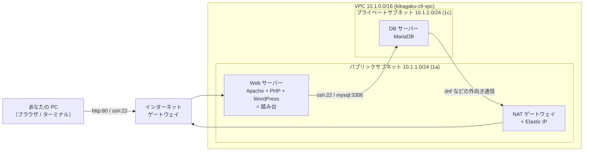

# レクチャー資料（手を動かして作る版）

CloudFormation を使わず、**自分の手で 1 つずつ AWS リソースを作る**ためのハンズオン資料です。
Notion の手順書と e-learning「CLI によるインフラ構築」の内容を、AWS を初めて触る人が **この 3 ファイルだけで最後まで進められる**ように書き直したものです。

| ファイル | 回 | 作るもの | ゴール |
|---|---|---|---|
| [day1.md](day1.md) | 第2回（Notion Day1） | VPC → サブネット → IGW → ルートテーブル → SG → EC2、Apache | ブラウザで **It works!** を出す |
| [day2.md](day2.md) | 第3回（Notion Day2） | プライベートサブネット → DB 用 EC2 → 踏み台 → NAT ゲートウェイ | 外から見えないサーバーが、**外に出られる** |
| [day3.md](day3.md) | 第4回（Notion Day3） | MariaDB → WordPress → sample.php | 自分の **ブログが動く** |

3 日分をつなげると、次の構成になります。

## 読み方

- 各ファイルは「今日のゴール → 準備 → 手順（コマンドと、それが何をしているか） → 確認 → 詰まったとき → 演習 → 片付けと次回への注意」の順です。
- コマンドの `（ ）` の中は自分の値に置き換えます。ID の貼り間違いを減らすため、CloudShell の**変数**に入れて使う書き方にしています。
- 各手順の「何をしているか」を読んでから打ってください。写すだけでも動きますが、後で「なぜ繋がらないか」を自分で切り分けられるようになるのはここを読んだ人です。

## 前の回を欠席した人

前の回の完成形を CloudFormation で一気に作れます（[../README.md](../README.md)）。`stage1-day1.yaml` を作れば day2.md から、`stage2-day2.yaml` を作れば day3.md から始められます。

## 全部消したいとき

[../docs/cleanup-manual.md](../docs/cleanup-manual.md) の CloudShell 1 行で、手で作ったものも含めて全部消えます。
