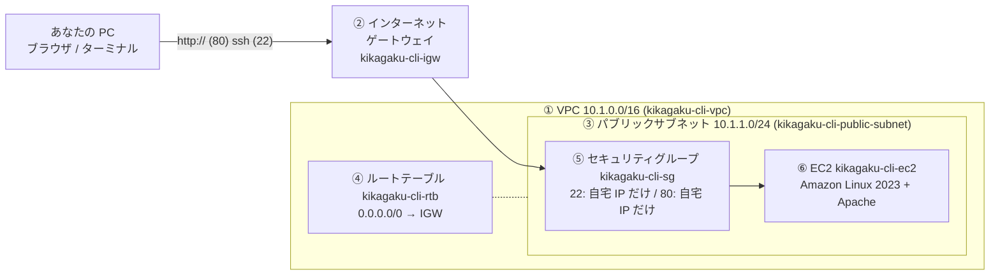

# Day1: Web サーバーをインターネットに公開する（第2回フォローアップ会）

**今日のゴール**: AWS に自分専用のネットワークを作り、その中に仮想サーバーを 1 台立て、ブラウザで「**It works!**」を表示する。
そして「なぜ繋がるのか」「繋がらないときどこを見るか」を自分の言葉で説明できるようになる。

所要時間の目安: 90〜120 分（詰まったら [7. 詰まったとき](#7-詰まったとき) を見てください）

---

## 目次

1. [今日作るもの](#1-今日作るもの)
2. [準備（10 分）](#2-準備10-分)
3. [ネットワークを作る（VPC → サブネット → IGW → ルートテーブル）](#3-ネットワークを作るvpc--サブネット--igw--ルートテーブル)
4. [サーバーを作る（キーペア → セキュリティグループ → EC2）](#4-サーバーを作るキーペア--セキュリティグループ--ec2)
5. [サーバーに入って Apache を動かす](#5-サーバーに入って-apache-を動かす)
6. [ブラウザで It works! を出す](#6-ブラウザで-it-works-を出す)
7. [詰まったとき](#7-詰まったとき)
8. [演習（ペアワーク）: 相手のサーバーを見に行く](#8-演習ペアワーク-相手のサーバーを見に行く)
9. [片付けと次回への注意](#9-片付けと次回への注意)
10. [今日のまとめ](#10-今日のまとめ)

---

## 1. 今日作るもの



作る順番は **外側から内側へ** です。器（VPC）がないと区画（サブネット）は作れず、玄関（IGW）と道（ルートテーブル）がないと外と繋がらず、警備員（SG）を決めてから住人（EC2）を入れます。

| 番号 | 部品 | 一言でいうと | 今日の値 |
|---|---|---|---|
| ① | VPC | AWS の中に作る自分専用のネットワーク空間（器） | `10.1.0.0/16` |
| ② | インターネットゲートウェイ（IGW） | VPC とインターネットをつなぐ玄関 | VPC にアタッチ |
| ③ | サブネット | VPC の中の区画。今日は外向けの「パブリック」を 1 つ | `10.1.1.0/24`、AZ `ap-northeast-1a` |
| ④ | ルートテーブル | 「どこ宛ての通信をどこへ送るか」の道路地図 | `0.0.0.0/0 → IGW` |
| ⑤ | セキュリティグループ（SG） | EC2 の前に立つ警備員。「どのポートに、どこから入ってよいか」 | 22 番と 80 番を自宅 IP からだけ |
| ⑥ | EC2 | 仮想サーバー。今日の主役 | `t2.micro`、Amazon Linux 2023 |

**今日出てくる「3 つの数字」**（CIDR 表記）

| 数字 | 意味 | 使う場所 |
|---|---|---|
| `10.1.0.0/16` | ネットワーク部 16 ビット。この VPC で使える IP は約 65,000 個 | VPC |
| `10.1.1.0/24` | その中の 256 個分の区画（10.1.1.1〜10.1.1.254 を EC2 に配る） | サブネット |
| `自宅IP/32` | ホスト部 0 ビット ＝ その 1 台だけ | SG の「ソース」 |

数字が小さいほど範囲が広い（/16 ＞ /24 ＞ /32）と覚えてください。

---

## 2. 準備（10 分）

### 2-1. リージョンを東京にする

AWS コンソール右上のリージョンが **アジアパシフィック（東京）ap-northeast-1** になっていることを確認します。違うリージョンで作ると、次回以降の手順と食い違います。

### 2-2. CloudShell を開く

今日のコマンドは **CloudShell**（コンソール右上の `>_` アイコン）で打ちます。AWS CLI が最初から入っていて、ログイン済みなので、PC に何も入れなくて済みます。

開いたら、CLI がどのリージョンを向いているか確認します。

```bash
aws configure list
```

`region` の行の Value が `ap-northeast-1` なら OK です。CloudShell はコンソールで選んでいるリージョンを自動で使います。

> 自分の PC の AWS CLI で進めたい人は、`aws configure` でアクセスキーとリージョン（ap-northeast-1）を設定してから同じコマンドを打ってください。キーペアのダウンロード手順（4-1）だけが変わります。

### 2-3. 自宅のグローバル IP をメモする

**自分の PC のブラウザで**（CloudShell ではなく）次を開き、表示された数字をメモします。

https://checkip.amazonaws.com/

これが「あなたの家がインターネット上でどう見えているか」の番号です。後でセキュリティグループに「この IP からだけ入ってよい」と書きます。CloudShell で `curl` すると AWS 側の IP が出てしまうので、必ず自分の PC で見てください。

### 2-4. 変数の使い方（ID の貼り間違いを防ぐ）

AWS のリソースには `vpc-0cc7f8e53a680b608` のような ID が付きます。これを毎回コピーして貼ると、**サブネットの欄に VPC の ID を貼る**ような事故が起きます（第1回で実際に起きました）。

今日は作った ID をそのまま**変数**に入れて使います。

```bash
# 例: 作った VPC の ID を VPC_ID という変数に入れる
VPC_ID=$(aws ec2 create-vpc --cidr-block 10.1.0.0/16 --query 'Vpc.VpcId' --output text)
echo $VPC_ID      # 中身を確認。vpc-xxxx と出れば OK
```

- `--query 'Vpc.VpcId' --output text` は「出力のうち VpcId の値だけを、飾りなしの文字で出して」という指定です
- `$( … )` はコマンドの結果を受け取る書き方、`VPC_ID=` はそれを変数に入れる書き方です
- 以降 `$VPC_ID` と書くと、その値に置き換わります

**ID の接頭辞を見れば何の ID か分かります。** エラーが出たら、まずここを疑ってください。

| 接頭辞 | 何の ID |
|---|---|
| `vpc-` | VPC |
| `subnet-` | サブネット |
| `igw-` | インターネットゲートウェイ |
| `rtb-` | ルートテーブル |
| `sg-` | セキュリティグループ |
| `i-` | EC2 インスタンス |
| `ami-` | マシンイメージ（OS のひな形） |

> CloudShell は 20 分ほど操作しないとセッションが切れ、**変数が消えます**。消えたら [7-1. 変数が消えたとき](#7-1-変数が消えたとき) のコマンドで作り直せます。

---

## 3. ネットワークを作る（VPC → サブネット → IGW → ルートテーブル）

### 3-1. VPC を作る（器）

```bash
VPC_ID=$(aws ec2 create-vpc --cidr-block 10.1.0.0/16 --query 'Vpc.VpcId' --output text)
echo $VPC_ID
```

**何をしているか**: AWS の中に `10.1.0.0/16` の範囲を持つ自分専用のネットワーク空間を作っています。他のアカウントからは見えません。

CLI で作ると名前が付かないので、タグで名前を付けます。コンソールで見つけやすくするためです。

```bash
aws ec2 create-tags --resources $VPC_ID --tags Key=Name,Value=kikagaku-cli-vpc
```

確認:

```bash
aws ec2 describe-vpcs --vpc-ids $VPC_ID --query 'Vpcs[0].[VpcId,CidrBlock,Tags[0].Value]' --output table
```

`10.1.0.0/16` と `kikagaku-cli-vpc` が出れば成功です。

### 3-2. サブネットを作る（区画）

```bash
SUBNET_ID=$(aws ec2 create-subnet --vpc-id $VPC_ID --cidr-block 10.1.1.0/24 --availability-zone ap-northeast-1a --query 'Subnet.SubnetId' --output text)
echo $SUBNET_ID
aws ec2 create-tags --resources $SUBNET_ID --tags Key=Name,Value=kikagaku-cli-public-subnet
```

**何をしているか**: VPC の中に `10.1.1.0/24`（256 個分）の区画を、東京リージョンの `1a` というデータセンター群（アベイラビリティゾーン）に作っています。

このサブネットに置いた EC2 に、自動でパブリック IP（インターネットから届く番号）が付くようにします。

```bash
aws ec2 modify-subnet-attribute --subnet-id $SUBNET_ID --map-public-ip-on-launch
```

**何をしているか**: この設定がないと、EC2 は VPC の中だけで使えるプライベート IP しか持たず、外から届きません。

確認:

```bash
aws ec2 describe-subnets --subnet-ids $SUBNET_ID --query 'Subnets[0].[CidrBlock,AvailabilityZone,MapPublicIpOnLaunch,Tags[0].Value]' --output table
```

`MapPublicIpOnLaunch` が `True` になっていれば OK です。

> **ここがポイント**: 今の時点では、このサブネットはまだ「パブリック」ではありません。パブリックかどうかは、この後作る**ルートテーブルに IGW への道があるか**で決まります。名前に public と付けても、道がなければプライベートです。

### 3-3. インターネットゲートウェイを作って VPC に付ける（玄関）

```bash
IGW_ID=$(aws ec2 create-internet-gateway --query 'InternetGateway.InternetGatewayId' --output text)
echo $IGW_ID
aws ec2 create-tags --resources $IGW_ID --tags Key=Name,Value=kikagaku-cli-igw
aws ec2 attach-internet-gateway --vpc-id $VPC_ID --internet-gateway-id $IGW_ID
```

**何をしているか**: IGW は VPC とインターネットをつなぐ玄関です。作っただけでは宙に浮いているので、`attach` で VPC に取り付けます。

確認:

```bash
aws ec2 describe-internet-gateways --internet-gateway-ids $IGW_ID --query 'InternetGateways[0].Attachments[0].[VpcId,State]' --output table
```

`VpcId` が自分の VPC、`State` が `available` なら OK です。

### 3-4. ルートテーブルを作って「外への道」を書く（道路地図）

```bash
RTB_ID=$(aws ec2 create-route-table --vpc-id $VPC_ID --query 'RouteTable.RouteTableId' --output text)
echo $RTB_ID
aws ec2 create-tags --resources $RTB_ID --tags Key=Name,Value=kikagaku-cli-rtb
```

**何をしているか**: ルートテーブルは「宛先がこの範囲なら、ここへ送る」という表です。作った直後は `10.1.0.0/16 → local`（VPC の中は直接届く）の 1 行だけです。

ここに「それ以外の宛先（`0.0.0.0/0` ＝ 全部）は IGW へ」という行を足します。

```bash
aws ec2 create-route --route-table-id $RTB_ID --destination-cidr-block 0.0.0.0/0 --gateway-id $IGW_ID
```

そして、この表をサブネットに関連付けます。**この瞬間に、サブネットは「パブリック」になります。**

```bash
aws ec2 associate-route-table --subnet-id $SUBNET_ID --route-table-id $RTB_ID
```

確認:

```bash
aws ec2 describe-route-tables --route-table-ids $RTB_ID --query 'RouteTables[0].Routes[].[DestinationCidrBlock,GatewayId,State]' --output table
```

次の 2 行が出れば OK です。

```
10.1.0.0/16   local        active
0.0.0.0/0     igw-xxxx     active
```

> **IGW とルートテーブルはセット**で覚えてください。玄関（IGW）だけ作っても、道（ルート）を書かないと通信は迷子になります。

ここまでで「器・区画・玄関・道」ができました。コンソールの VPC 画面で、`kikagaku-cli-vpc` とその中身を眺めてみてください。

---

## 4. サーバーを作る（キーペア → セキュリティグループ → EC2）

### 4-1. キーペアを作って、秘密鍵を PC にダウンロードする

```bash
aws ec2 create-key-pair --key-name kikagaku-cli-key --query 'KeyMaterial' --output text > kikagaku-cli-key.pem
ls -l kikagaku-cli-key.pem
```

**何をしているか**: サーバーに入るための「鍵」を作っています。AWS が鍵のペア（公開鍵・秘密鍵）を作り、公開鍵は AWS 側に、秘密鍵（`.pem`）は `>` でファイルに書き出しています。**秘密鍵はこの 1 回しかもらえません。** 無くしたらキーペアを作り直します。

今このファイルは **CloudShell の中**にあります。SSH は自分の PC から行うので、PC にダウンロードします。

1. CloudShell 右上の「**アクション**」→「**ファイルのダウンロード**」
2. ファイルパスに `kikagaku-cli-key.pem` と入力して「ダウンロード」
3. 分かる場所（例: `Downloads` や `aws` フォルダ）に保存する

ダウンロードしたら、**自分の PC のターミナル**で権限を絞ります。緩いままだと SSH が「この鍵は他人にも読める」と拒否します。

```bash
# Mac: ターミナルで、.pem を保存したフォルダに移動してから
chmod 600 kikagaku-cli-key.pem
```

```powershell
# Windows: PowerShell で、.pem を保存したフォルダに移動してから
icacls "kikagaku-cli-key.pem" /inheritance:r /grant:r "$($env:USERNAME):R"
```

> 自分の PC の CLI で作った人は、`.pem` はすでに PC にあります。ダウンロードは不要で、`chmod` / `icacls` だけ行ってください。

### 4-2. セキュリティグループを作る（警備員）

```bash
SG_ID=$(aws ec2 create-security-group --group-name kikagaku-cli-sg --description "web server sg" --vpc-id $VPC_ID --query 'GroupId' --output text)
echo $SG_ID
```

**何をしているか**: EC2 の前に立つ警備員を用意しました。作った直後は「入ってくる通信（インバウンド）は全部拒否」です。

ここに「自宅の IP から、22 番（SSH）だけ通してよい」というルールを足します。`（自宅IP）` は 2-3 でメモした数字に置き換えてください。

```bash
MY_IP=（自宅IP）          # 例: MY_IP=113.147.224.53
aws ec2 authorize-security-group-ingress --group-id $SG_ID --protocol tcp --port 22 --cidr $MY_IP/32
```

**何をしているか**: `--cidr $MY_IP/32` の `/32` は「この 1 台だけ」という意味です。もし `0.0.0.0/0`（全世界）にすると、公開から数分で世界中から SSH の総当たり攻撃が来ます。これは本当に起きます。

確認:

```bash
aws ec2 describe-security-groups --group-ids $SG_ID --query 'SecurityGroups[0].IpPermissions[].[FromPort,IpProtocol,IpRanges[0].CidrIp]' --output table
```

`22 / tcp / 自宅IP/32` の 1 行が出れば OK です。80 番はまだ開けません。**わざと**です（6 章で「繋がらない」を体験してから開けます）。

### 4-3. EC2 を起動する（仮想サーバー）

まず、Amazon Linux 2023 の最新 AMI（OS のひな形）の ID を取ります。AMI ID は定期的に変わるので、固定の ID を写すより、この方法が確実です。

```bash
AMI_ID=$(aws ssm get-parameters --names /aws/service/ami-amazon-linux-latest/al2023-ami-kernel-default-x86_64 --query 'Parameters[0].Value' --output text)
echo $AMI_ID
```

> e-learning に載っている `ami-0b193da66bc27147b` も Amazon Linux 2023 ですが、古くなると使えなくなることがあります。上のコマンドで取った ID を使ってください。

サーバーを起動します。

```bash
INSTANCE_ID=$(aws ec2 run-instances \
  --image-id $AMI_ID \
  --count 1 \
  --instance-type t2.micro \
  --key-name kikagaku-cli-key \
  --security-group-ids $SG_ID \
  --subnet-id $SUBNET_ID \
  --query 'Instances[0].InstanceId' --output text)
echo $INSTANCE_ID
aws ec2 create-tags --resources $INSTANCE_ID --tags Key=Name,Value=kikagaku-cli-ec2
```

**何をしているか**（オプションの意味）

| オプション | 意味 | 今日の値 |
|---|---|---|
| `--image-id` | OS のひな形（AMI） | Amazon Linux 2023 の最新 |
| `--instance-type` | サーバーの大きさ | `t2.micro`（無料枠。月 750 時間まで） |
| `--key-name` | どの鍵で入れるようにするか | `kikagaku-cli-key` |
| `--security-group-ids` | どの警備員を付けるか | さっき作った SG |
| `--subnet-id` | どの区画に置くか | パブリックサブネット |

1〜2 分待って、状態と IP を確認します。

```bash
aws ec2 wait instance-running --instance-ids $INSTANCE_ID
aws ec2 describe-instances --instance-ids $INSTANCE_ID --query 'Reservations[0].Instances[0].[State.Name,PublicIpAddress,PrivateIpAddress]' --output table
```

`running` と、パブリック IP（例 `43.207.xxx.xxx`）とプライベート IP（`10.1.1.x`）が出れば成功です。**パブリック IP をメモしてください。** この後ずっと使います。

コンソールの EC2 → インスタンスでも `kikagaku-cli-ec2` が見えるはずです。

> **2 つの IP の違い**: パブリック IP はインターネットから届く番号（停止→起動で**変わります**）。プライベート IP は VPC の中だけで通じる番号（変わりません）。自宅から SSH するのはパブリック IP です。

---

## 5. サーバーに入って Apache を動かす

### 5-1. SSH で入る

**自分の PC のターミナル**（CloudShell ではなく）で、`.pem` を保存したフォルダに移動してから:

```bash
cd （.pem を保存したフォルダ）
ssh -i kikagaku-cli-key.pem ec2-user@（パブリックIP）
```

`Are you sure you want to continue connecting (yes/no/[fingerprint])?` と聞かれたら `yes` と入力します（初めて繋ぐサーバーの確認です）。

プロンプトが `[ec2-user@ip-10-1-1-x ~]$` に変わったら成功です。あなたは今、東京のデータセンターにある自分のサーバーの中にいます。`ip-10-1-1-x` はそのサーバーのプライベート IP です。

**何をしているか**: `ssh` は暗号化された通信でサーバーの操作画面を手元に持ってくるコマンドです。`-i` で秘密鍵を指定し、`ec2-user` は Amazon Linux に最初から居るユーザーです。

### 5-1b. CloudShell から ssh したい場合（PC から ssh できない人向け）

Day1 の設計は「CLI は CloudShell、ssh は自分の PC」です。でも、PC に ssh が入っていない、会社のネットワークが 22 番を止めている、などの理由で **CloudShell から ssh したい**こともあります。

そのまま CloudShell で `ssh -i kikagaku-cli-key.pem ec2-user@（パブリックIP）` を打つと、**タイムアウト**します。

**なぜか**: SG に書いたのは「あなたの PC の IP」（2-3 でメモした値）です。CloudShell は AWS の中で動いている別の環境なので、そこから出ていく通信は**別の IP**を持っています。SG は「どこから来たか」で判定するので、CloudShell からの 22 番は捨てられます。SG が正しく仕事をしている証拠です。

対処は 3 つあります。上から順におすすめです。

**方法 A（おすすめ）: CloudShell の IP を SG に足す**

CloudShell の中で、自分（CloudShell）が外からどう見えているかを調べます。

```bash
curl -s https://checkip.amazonaws.com
```

出てきた IP を SG に追加します（`$SG_ID` は 4-2 の変数。消えていたら 7-1 で復元）。

```bash
CS_IP=$(curl -s https://checkip.amazonaws.com)
aws ec2 authorize-security-group-ingress --group-id $SG_ID --protocol tcp --port 22 --cidr $CS_IP/32
```

これで CloudShell から ssh できます。鍵は CloudShell の中にあるので、権限を絞ってから接続します。

```bash
chmod 600 kikagaku-cli-key.pem
ssh -i kikagaku-cli-key.pem ec2-user@（パブリックIP）
```

**注意**: CloudShell の IP は**セッションごとに変わります**。翌日また繋がらなくなったら、もう一度 `curl` して足してください。使い終わったら、そのルールは消しておきます（自分のサーバーに入れる場所を最小にする習慣）。

```bash
aws ec2 revoke-security-group-ingress --group-id $SG_ID --protocol tcp --port 22 --cidr $CS_IP/32
```

> この方法は「SG のソースは**出発点の IP**」という今日の学びそのものです。PC から繋ぐなら PC の IP、CloudShell から繋ぐなら CloudShell の IP、と考えれば迷いません。

**方法 B: EC2 Instance Connect（ブラウザから ssh）**

EC2 → インスタンスを選択 → 右上「**接続**」→「EC2 Instance Connect」タブ →「接続」で、ブラウザの中にターミナルが開きます。鍵ファイルの扱いが不要で、Amazon Linux 2023 なら最初から使えます。

ただし SG に、Instance Connect サービスの IP 範囲（東京リージョンは `3.112.23.0/29`）からの 22 番を許可しておく必要があります。範囲が変わっていないかは [AWS の IP 範囲一覧](https://ip-ranges.amazonaws.com/ip-ranges.json) の `EC2_INSTANCE_CONNECT` / `ap-northeast-1` で確認できます。

```bash
aws ec2 authorize-security-group-ingress --group-id $SG_ID --protocol tcp --port 22 --cidr 3.112.23.0/29
```

**方法 C（非推奨）: 0.0.0.0/0 を一時的に開ける**

SSH のソースを `0.0.0.0/0`（全世界）にすれば、どこからでも繋がります。動きますが、**公開から数分で世界中から総当たりが来ます**。鍵認証なので簡単には入られませんが、4-2 で「だから /32 にする」と学んだ直後にやることではありません。

どうしても使うなら「演習の間だけ、終わったら必ず戻す」を条件にしてください。開けたままにした人は、翌週に `sudo journalctl -u sshd | grep "Invalid user" | wc -l` で攻撃の回数を数えてみてください。数千回になっています。

**実務の答え**: SSM Session Manager を使い、22 番自体を開けません。IAM ロールを EC2 に付ける手順が要るので、今日は扱いません（第3回の「実務ではこうなる」で触れます）。

### 5-2. Apache をインストールして起動する

ここからは **サーバーの中**（プロンプトが `ec2-user@ip-10-1-1-x`）で打ちます。

```bash
sudo dnf install -y httpd
```

**何をしているか**: `dnf` は Amazon Linux のパッケージ管理コマンド（Ubuntu の `apt` に相当）で、インターネットから Apache（プログラム名 `httpd`）を取ってきて入れています。`sudo` は管理者権限で実行する、`-y` は「確認に全部 yes」です。

```bash
sudo systemctl start httpd     # 今すぐ起動
sudo systemctl enable httpd    # サーバー再起動時も自動で起動
```

動いているか確認します。

```bash
ps -ax | grep httpd
```

`/usr/sbin/httpd -DFOREGROUND` を含む行が数行出れば、Apache が動いています。`ps -ax` は動いているプログラム一覧、`|` は前の結果を次のコマンドに渡す「パイプ」、`grep httpd` は httpd を含む行だけを抜き出す、という意味です。

もう一つ、サーバーが「どのポートで待っているか」を見る方法を覚えてください。この後の切り分けで一番役に立つコマンドです。

```bash
sudo lsof -i -n -P | grep LISTEN
```

```
sshd    ...  TCP *:22 (LISTEN)     ← SSH が 22 番で待っている
httpd   ...  TCP *:80 (LISTEN)     ← Apache が 80 番で待っている
```

**何をしているか**: `LISTEN` は「そのポートで接続を待ち構えている」状態です。`httpd` が `*:80` で LISTEN していれば、サーバー側の準備は完了です。あとは外から 80 番に届くかどうか、です。

---

## 6. ブラウザで It works! を出す

### 6-1. まず「繋がらない」を体験する

自分の PC のブラウザで、次を開いてください（`https` ではなく **`http`**）。

```
http://（パブリックIP）/
```

> **注意: EC2 コンソールの IP リンクは https になります。** EC2 → インスタンス → 「パブリック IPv4 アドレス」の横にある「オープンアドレス」リンクをクリックすると、ブラウザは `https://（IP）` で開こうとします。今日のサーバーは https（443 番）を用意していないので、**アドレスバーの `https` の `s` を消して `http://（IP）/` に直してから Enter** してください。アドレスを手で打つのが確実です。

しばらく待って「**タイムアウト**」「応答時間が長すぎます」のようなエラーになるはずです。

**なぜか**: サーバーの中では Apache が 80 番で待っています（5-2 で確認済み）。でも警備員（SG）には「22 番だけ通す」としか書いていないので、80 番の通信はサーバーに届く前に捨てられています。**タイムアウト ＝ 届いていない ＝ 経路の問題**、です。

### 6-2. SG に 80 番を足す

**まず、サーバーから抜けて CloudShell に戻ります。** 今あなたのプロンプトは `[ec2-user@ip-10-1-1-x ~]$`（サーバーの中）のはずです。サーバーの中では `aws` コマンドは使えず、`$SG_ID` などの変数も見えません。

```bash
exit
```

（`Ctrl+D` でも抜けられます。`Ctrl+C` は「今動いているコマンドを止める」だけで、サーバーからは出られません。）

プロンプトが `[cloudshell-user@ip-... ~]$` のような CloudShell のものに戻ったことを確認してから、自宅 IP からの 80 番を許可します。

```bash
echo $SG_ID $MY_IP      # 両方の値が出ることを確認（空なら 7-1 で復元、MY_IP は 4-2 で再設定）
aws ec2 authorize-security-group-ingress --group-id $SG_ID --protocol tcp --port 80 --cidr $MY_IP/32
```

> PC のターミナルから ssh していて、CloudShell はブラウザの別タブ、という人は、CloudShell のタブでそのまま打てば OK です（ssh の窓は開けたままで構いません）。

> コンソールでやる場合: EC2 → インスタンス → `kikagaku-cli-ec2` → 下の「セキュリティ」タブ → セキュリティグループのリンク → 「インバウンドルールを編集」→「ルールを追加」で タイプ `HTTP`、ソース `自宅IP/32` を追加 → 保存。

### 6-3. もう一度ブラウザで開く

```
http://（パブリックIP）/
```

（ここでも `https` ではなく `http` です。EC2 コンソールのリンクから開いた人は `s` を消してください。）

「**It works!**」と表示されたら成功です。おめでとうございます。あなたは今日、インターネットに自分のサーバーを公開しました。

**通信の道をなぞってみましょう**（繋がらないときは、この順に上から確認します）

```
ブラウザ（あなたの PC）
  → http://パブリックIP           ← http:// であること
  → インターネット
  → インターネットゲートウェイ     ← VPC にアタッチされているか
  → ルートテーブル                 ← 0.0.0.0/0 → IGW の行があるか（戻りの通信に必要）
  → セキュリティグループ           ← 80 番が自宅 IP から許可されているか
  → EC2                            ← 起動しているか
  → Apache（httpd）                ← 80 番で LISTEN しているか
  → It works!
```

### 6-4. サーバーから出る

まだサーバーの中にいる窓があれば、そこで:

```bash
exit
```

プロンプトが自分の PC（または CloudShell）に戻ります。6-2 ですでに抜けている人はそのままで OK です。

> **コラム: IP ではなく名前で開く**
> VPC の設定で「DNS ホスト名を有効化」にすると、EC2 に `ec2-43-207-xxx-xxx.ap-northeast-1.compute.amazonaws.com` のような名前が付き、`http://その名前/` でも開けます。VPC → 自分の VPC → アクション → VPC の設定を編集 → DNS ホスト名を有効化。

---

## 7. 詰まったとき

まず「症状」の行を探してください。

| 症状 | 原因 | 対処 |
|---|---|---|
| `InvalidSubnetID.NotFound` など「存在しない」系のエラー | ID の貼り間違い（`vpc-` を subnet の欄に貼った等）／変数が消えた | エラー文の `( )` の中を読む。`echo $SUBNET_ID` で中身を確認。空なら [7-1](#7-1-変数が消えたとき) |
| `ssh: Permission denied (publickey)` | 鍵の権限が緩い／ユーザー名が違う／別の鍵を指定している | `chmod 600` または `icacls`。ユーザーは `ec2-user`。`-i` のファイル名を確認 |
| `ssh: connect to host ... Operation timed out` | SG に 22 番がない／自宅 IP が変わった／パブリック IP を間違えている | SG を確認。checkip で IP を再確認して SG を直す。EC2 画面で IP を確認 |
| **CloudShell から** ssh でタイムアウト | SG のソースが PC の IP になっていて、CloudShell の IP と違う | [5-1b](#5-1b-cloudshell-から-ssh-したい場合pc-から-ssh-できない人向け)。CloudShell で `curl checkip` した IP を /32 で足す。0.0.0.0/0 にはしない |
| `aws` コマンドが `command not found`／`$SG_ID` が空 | **サーバーの中**で打っている（プロンプトが `ec2-user@ip-10-1-1-x`） | `exit` で CloudShell に戻ってから打つ。`Ctrl+C` では出られない |
| EC2 コンソールのリンクから開くと繋がらない | リンクが `https://` で開く | アドレスバーの `s` を消して `http://` にする |
| ブラウザで **タイムアウト** | SG に 80 番がない／`https://` で開いている | 経路の問題。6-2 の SG 追加。`http://` で開く |
| ブラウザで **接続が拒否されました** | httpd が動いていない | サーバー側の問題。`sudo systemctl start httpd`、`sudo lsof -i -n -P` で 80 番の LISTEN を確認 |
| 昨日は繋がったのに今日は繋がらない | 自宅のグローバル IP が変わった（ルーター再起動、テザリング） | checkip で確認し、SG のソースを新しい IP/32 に更新 |
| EC2 を停止して起動したら IP が変わった | パブリック IP は停止→起動で変わる仕様 | 新しい IP で ssh。SG は IP ではなくポートの設定なので直す必要なし |
| Windows で `chmod` が無い | Windows には chmod がない | 4-1 の `icacls` を使う |
| CloudShell で `aws configure list` の region が違う | コンソールのリージョンが東京でない | 右上のリージョンを東京に切り替えて、CloudShell を開き直す |

**切り分けの合言葉**: タイムアウト＝手前（経路: SG・ルート・IP）、拒否＝奥（サーバー: httpd）。上から順に見れば必ず原因に着きます。

### 7-1. 変数が消えたとき

CloudShell のセッションが切れると変数は消えます。作ったリソースは残っているので、名前から ID を引き直せます。まとめて貼ってください。

```bash
VPC_ID=$(aws ec2 describe-vpcs --filters Name=tag:Name,Values=kikagaku-cli-vpc --query 'Vpcs[0].VpcId' --output text)
SUBNET_ID=$(aws ec2 describe-subnets --filters Name=tag:Name,Values=kikagaku-cli-public-subnet --query 'Subnets[0].SubnetId' --output text)
IGW_ID=$(aws ec2 describe-internet-gateways --filters Name=tag:Name,Values=kikagaku-cli-igw --query 'InternetGateways[0].InternetGatewayId' --output text)
RTB_ID=$(aws ec2 describe-route-tables --filters Name=tag:Name,Values=kikagaku-cli-rtb --query 'RouteTables[0].RouteTableId' --output text)
SG_ID=$(aws ec2 describe-security-groups --filters Name=group-name,Values=kikagaku-cli-sg --query 'SecurityGroups[0].GroupId' --output text)
INSTANCE_ID=$(aws ec2 describe-instances --filters Name=tag:Name,Values=kikagaku-cli-ec2 Name=instance-state-name,Values=running,stopped --query 'Reservations[0].Instances[0].InstanceId' --output text)
echo VPC=$VPC_ID SUBNET=$SUBNET_ID IGW=$IGW_ID RTB=$RTB_ID SG=$SG_ID EC2=$INSTANCE_ID
```

`None` と出たものは、まだ作っていない（またはタグ名が違う）リソースです。

---

## 8. 演習（ペアワーク）: 相手のサーバーを見に行く

2 人 1 組で、お互いのサーバーにアクセスします。**「SG のソースに相手の IP を足す」と「アクセスログを読む」**の 2 つが今日の学びです。

| 手順 | やること | ヒント |
|---|---|---|
| 1 | Apache のトップページを編集して、好きな果物の名前を書く | `sudo nano /var/www/html/index.html`（保存は Ctrl+O → Enter、終了は Ctrl+X） |
| 2 | 自宅の IP を教え合い、相手の IP を自分の SG に `/32` で追加する（80 番） | 6-2 のコマンドの `$MY_IP` を相手の IP に |
| 3 | 相手のページをブラウザで見る | `http://相手のパブリックIP/` |
| 4 | 「あなたの好きな果物は○○です」に書き換える（○○は相手のページで見た果物） | `nano` |
| 5 | お互いのページを見て答え合わせ | |
| 6 | アクセスログで、相手が本当に見たか確認する | `sudo tail -n 5 /var/log/httpd/access_log` |

**何をしているか（手順 1）**: Apache は `http://IP/` にアクセスが来ると `/var/www/html/index.html` を返します。このファイルを書き換える＝ページが変わる、です。`nano` はサーバーの中で使えるテキストエディタです。

**何をしているか（手順 6）**: Apache は誰がいつ来たかを `/var/log/httpd/access_log` に 1 行ずつ残します。`tail -n 5` は末尾 5 行を表示します。

```
113.147.xxx.xxx - - [28/Sep/2026:12:34:56 +0000] "GET / HTTP/1.1" 200 ...
```

先頭の IP が相手の自宅 IP なら、相手が本当に見た証拠です。時刻は UTC（日本時間 −9 時間）です。

演習が終わったら、相手の IP のルールは SG から外しておきましょう（自分のサーバーに入れる人を最小にする習慣です）。

> ヒントを見ずに、生成 AI に「Amazon Linux で Apache のトップページを編集するには？」と聞きながら進めてみるのもおすすめです。

---

## 9. 片付けと次回への注意

- **今日作った EC2 は削除しないでください。** 第3回（Day2）でこのサーバーを「踏み台」として使います。
- 課金が気になる人は「**停止**」（EC2 → インスタンスの状態 → 停止）で構いません。停止中は課金されません（t2.micro は無料枠内でもあります）。
- ただし **停止→起動でパブリック IP が変わります**。次回は EC2 画面で新しい IP を確認してから ssh してください。
- 自宅 IP が変わっていたら、SG のソースも直してください。

全部消してやり直したい人は [../docs/cleanup-manual.md](../docs/cleanup-manual.md) を見てください。次回までにもう一度作り直す時間がない人は、[../README.md](../README.md) の `stage1-day1.yaml` で今日の完成形を 5 分で作れます。

---

## 10. 今日のまとめ

- 作る順番は **VPC → サブネット → IGW → ルートテーブル → SG → EC2**（外側から内側へ）。
- サブネットが「パブリック」になるのは、**ルートテーブルに 0.0.0.0/0 → IGW の行がある**とき。名前ではなく道で決まる。
- SG のソースは **出発点の IP/32**。PC から繋ぐなら PC の IP、CloudShell から繋ぐなら CloudShell の IP。全世界（0.0.0.0/0）に 22 番を開けると数分で攻撃が来る。
- **タイムアウト＝経路、拒否＝サーバー**。`sudo lsof -i -n -P` で LISTEN を見れば、サーバー側の準備はすぐ分かる。
- 今日打ったコマンドを保存しておけば、同じ環境をもう一度作れる。それを 1 ファイルにまとめたものが CloudFormation（[../stage1-day1.yaml](../stage1-day1.yaml)）です。

**次回（Day2）**: 「隠す」。インターネットから見えない DB サーバーをプライベートサブネットに置き、踏み台経由で入り、NAT ゲートウェイで外に出ます。
