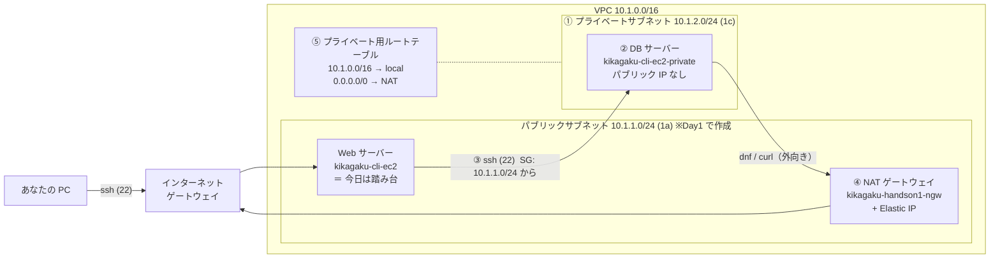
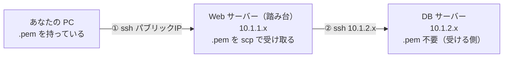

# Day2: 見えないサーバーを作り、踏み台で入り、NAT で外に出る（第3回フォローアップ会）

**今日のゴール**: インターネットから直接入れない「DB サーバー」をプライベートサブネットに置く。
そのサーバーに Web サーバー経由（踏み台）で入り、NAT ゲートウェイを通して外に出られるようにする。
そして「パブリックとプライベートの違いはルートテーブルで決まる」を自分の言葉で説明できるようになる。

所要時間の目安: 90〜120 分

---

## 目次

1. [今日作るもの](#1-今日作るもの)
2. [準備](#2-準備)
3. [プライベートサブネットを作る](#3-プライベートサブネットを作る)
4. [DB サーバー（EC2）をプライベートサブネットに置く](#4-db-サーバーec2をプライベートサブネットに置く)
5. [踏み台経由で DB サーバーに入る](#5-踏み台経由で-db-サーバーに入る)
6. [NAT ゲートウェイで「隠したまま外に出る」](#6-nat-ゲートウェイで隠したまま外に出る)
7. [詰まったとき](#7-詰まったとき)
8. [演習（ペアワーク）: NAT の IP 変換を目で見る](#8-演習ペアワーク-nat-の-ip-変換を目で見る)
9. [片付けと次回への注意（NAT の課金）](#9-片付けと次回への注意nat-の課金)
10. [今日のまとめ](#10-今日のまとめ)

---

## 1. 今日作るもの



| 番号 | 部品 | 一言でいうと | 今日の値 |
|---|---|---|---|
| ① | プライベートサブネット | 外から来られない区画。**IGW への道がない**のがプライベート | `10.1.2.0/24`、AZ `ap-northeast-1c` |
| ② | DB 用 EC2 | パブリック IP を持たないサーバー | `t2.micro`、鍵は Day1 と同じ |
| ③ | 踏み台（bastion） | 外から入れないサーバーに入るための中継役。今日は Web サーバーがその役 | PC → Web → DB の 2 段 |
| ④ | NAT ゲートウェイ | 内側から外へ出るときだけ通す装置。家の Wi-Fi ルーターと同じ役目 | **パブリックサブネットに置く** |
| ⑤ | プライベート用ルートテーブル | 「外向き（0.0.0.0/0）は NAT へ」と書いた道路地図 | プライベートサブネットに関連付け |

**今日の一番大事な考え方**: サブネットに「パブリック／プライベート」という設定項目はありません。**ルートテーブルの `0.0.0.0/0` がどこを向いているか**で性格が決まります。

| 0.0.0.0/0 の行き先 | 性格 | 今日の構成では |
|---|---|---|
| IGW | パブリック: 外から来られる・外に出られる | Web サーバーのサブネット |
| NAT ゲートウェイ | プライベート: 外から来られない・外には出られる | DB サーバーのサブネット（6 章の後） |
| 行がない（local のみ） | 閉域: VPC の中とだけ通信 | DB サーバーのサブネット（6 章の前） |

---

## 2. 準備

### 2-1. Day1 の環境があること

Day1 の Web サーバー（`kikagaku-cli-ec2`）が必要です。

- 停止していた人は **起動**してください（EC2 → インスタンス → 選択 → インスタンスの状態 → 開始）。**パブリック IP が変わる**ので、起動後に新しい IP をメモしてください。
- Day1 を欠席した／消してしまった人は、[../README.md](../README.md) の `stage1-day1.yaml` で 5 分で作れます。
- 自宅 IP が変わっていたら、SG `kikagaku-cli-sg` の 22 番・80 番のソースを新しい IP/32 に直してください（https://checkip.amazonaws.com/）。

### 2-2. 今日はコンソールで作る

Notion Day2 の手順に合わせ、今日は**マネジメントコンソール**（画面）で作ります。Day1 で CLI で作ったものが画面でどう見えるかを確認しながら進めてください。各節の表が、画面のどの欄に何を入れるかの一覧です。

> Day2 の完成形をコマンド 1 つで作りたい人は、[../README.md](../README.md) の `stage2-day2.yaml` を使ってください。

### 2-3. ターミナルを 2 つ開く

今日は「Web サーバーに入っている窓」と「DB サーバーに入っている窓」を並べて使います。プロンプトの `ip-10-1-1-x`（Web）と `ip-10-1-2-x`（DB）で、**今どこにいるか**を常に確認してください。

---

## 3. プライベートサブネットを作る

### 3-1. サブネットを作る

コンソールの検索窓に `vpc` と入力 → **VPC** → 左メニュー「**サブネット**」→「**サブネットを作成**」

| 項目 | 値 |
|---|---|
| VPC ID | `kikagaku-cli-vpc` を選ぶ |
| サブネット名 | `kikagaku-cli-private-subnet` |
| アベイラビリティゾーン | **`ap-northeast-1c`**（Day1 の 1a とは別） |
| IPv4 サブネット CIDR ブロック | `10.1.2.0/24` |

「サブネットを作成」を押します。

**何をしているか**: VPC `10.1.0.0/16` の中に、Day1 の `10.1.1.0/24` の隣に `10.1.2.0/24` の区画を作っています。AZ を分けているのは、実務では「片方のデータセンターが止まっても、もう片方が生きている」ようにするためです（今日は学習用なので冗長化はしません）。

### 3-2. ルートテーブルを見る（ここが重要）

作ったサブネットを選び、下の「**ルートテーブル**」タブを見てください。

```
10.1.0.0/16    local
```

の 1 行だけのはずです。これは VPC を作ったときに自動で付く「**メインルートテーブル**」です。

> **ポイント**: `0.0.0.0/0 → IGW` の行がありません。だからこのサブネットは今「プライベート」です。Day1 のサブネットは、自分で作ったルートテーブルに IGW への行を書いて関連付けたから「パブリック」になった、と思い出してください。**何もしなければ全部プライベート**、が AWS の初期状態です。

今はこのままにします（DB サーバーはまだ外に出る必要がないため）。6 章で NAT を作ってから、このサブネット専用のルートテーブルを作ります。

---

## 4. DB サーバー（EC2）をプライベートサブネットに置く

### 4-1. インスタンスを起動する

検索窓に `ec2` → **EC2** → 左メニュー「**インスタンス**」→「**インスタンスを起動**」

| 項目 | 値 |
|---|---|
| 名前 | `kikagaku-cli-ec2-private` |
| AMI | Amazon Linux 2023 AMI |
| インスタンスタイプ | `t2.micro` |
| キーペア | `kikagaku-cli-key`（**Day1 と同じもの**） |

「**ネットワーク設定**」の「編集」を押して:

| 項目 | 値 | なぜ |
|---|---|---|
| VPC | `kikagaku-cli-vpc` | |
| サブネット | `kikagaku-cli-private-subnet` | プライベートに置く |
| パブリック IP の自動割り当て | **無効化** | 外から届く番号を持たせない。**ここを忘れると台無し**です |
| ファイアウォール | セキュリティグループを作成 | |
| セキュリティグループ名 | `kikagaku-cli-sg-private` | |
| インバウンドルール | タイプ `SSH`、ソース **カスタム `10.1.1.0/24`** | パブリックサブネットの中（＝Web サーバー）からだけ SSH を許可 |

「インスタンスを起動」を押します。

**何をしているか**: SG のソースを「自宅 IP」ではなく「**パブリックサブネットの CIDR**」にしているのがポイントです。この DB サーバーには、自宅から直接ではなく、Web サーバーを経由してしか入れません。

### 4-2. 確認する

インスタンス一覧で `kikagaku-cli-ec2-private` を選び:

- **パブリック IPv4 アドレス が「−」（空）** であること
- **プライベート IPv4 アドレス が `10.1.2.x`** であること → **メモしてください**（この後ずっと使います）

---

## 5. 踏み台経由で DB サーバーに入る

DB サーバーにはパブリック IP がないので、自宅から直接 `ssh` はできません。**PC → Web サーバー → DB サーバー** と 2 段で入ります。この中継役を**踏み台（bastion）**と呼びます。SAA の問題文にも出てきます。



### 5-1. Web サーバーに入る（窓 1）

自分の PC のターミナルで、`.pem` のフォルダに移動してから:

```bash
ssh -i kikagaku-cli-key.pem ec2-user@（WebサーバーのパブリックIP）
```

プロンプトが `ip-10-1-1-x` になれば OK。この窓はこのまま開けておきます。

> CloudShell から ssh したい人は、Day1 の [5-1b](day1.md#5-1b-cloudshell-から-ssh-したい場合pc-から-ssh-できない人向け) のとおり、CloudShell の IP を SG `kikagaku-cli-sg` に足してください。`scp`（5-2）も CloudShell から同じように送れます（鍵は CloudShell にあるので `-i` の指定はそのまま）。

### 5-2. 鍵を Web サーバーに送る（窓 2）

Web サーバーから DB サーバーに ssh するにも鍵（`.pem`）が要ります。でも今、Web サーバーは鍵を持っていません。PC から送ります。

**新しいターミナルの窓**を開き、`.pem` のフォルダに移動してから:

```bash
scp -i kikagaku-cli-key.pem kikagaku-cli-key.pem ec2-user@（WebサーバーのパブリックIP）:/home/ec2-user/
```

**何をしているか**: `scp` は ssh を使ったファイルコピーです。`scp [オプション] 送るファイル 送り先` の順で、

- `-i kikagaku-cli-key.pem`: Web サーバーに入るための鍵（オプション）
- 2 つ目の `kikagaku-cli-key.pem`: 送るファイル
- `ec2-user@IP:/home/ec2-user/`: 送り先（Web サーバーのホームフォルダ）

「送るもの → 送り先」の向きを間違えやすいので注意してください。

窓 1（Web サーバーの中）に戻って、届いたか確認します。

```bash
ls
```

`kikagaku-cli-key.pem` が見えれば OK です。

### 5-3. Web サーバーから DB サーバーに入る（窓 1）

窓 1（Web サーバーの中）で:

```bash
ssh -i kikagaku-cli-key.pem ec2-user@（DBサーバーのプライベートIP）
```

`yes` と答えて、プロンプトが **`ip-10-1-2-x`** に変わったら成功です。見た目は似ていますが、IP の 3 つ目の数字が `1` から `2` に変わっています。あなたは今、インターネットから直接は届かないサーバーの中にいます。

`ls` を打ってみてください。DB サーバーには `.pem` がありません（受ける側には要らない）。

### 5-4. 通信の道をなぞる（プチ演習）

今の 2 段の通信が「なぜ通ったか」を、ルートテーブルと SG で説明してみてください。

1. **PC → Web サーバー**: パブリックサブネットのルートテーブルに `0.0.0.0/0 → IGW` がある（外から来られる）。SG `kikagaku-cli-sg` が自宅 IP からの 22 番を許可している
2. **Web サーバー → DB サーバー**: 同じ VPC の中なので `10.1.0.0/16 → local` で直接届く。SG `kikagaku-cli-sg-private` が `10.1.1.0/24` からの 22 番を許可している

この 2 つが両方そろって初めて通ります。片方でも欠けると「タイムアウト」です。

---

## 6. NAT ゲートウェイで「隠したまま外に出る」

### 6-1. なぜ必要か

次回（Day3）、DB サーバーに MariaDB を入れます。Web サーバーで Apache を入れたときと同じく `dnf install` で**インターネットから**取ってきます。

でも DB サーバーのサブネットには外への道がありません。試してみましょう。窓 1（DB サーバーの中）で:

```bash
curl -m 10 https://info.cern.ch/hypertext/WWW/TheProject.html
```

10 秒待って `Connection timed out` になるはずです。**外に出る道がない**からです。

ここで IGW への道を書けば外に出られますが、それでは外からも入れる「パブリック」になってしまいます。DB は隠したい。**「出られるけど入られない」**を実現するのが NAT（Network Address Translation）です。

**家の Wi-Fi ルーターと同じ**です。家のスマホや PC は `192.168.x.x` というプライベート IP を持っていますが、外から見ると全部 1 つのグローバル IP（Day1 に checkip で見た値）に見えます。内側から外へ出るときだけルーターが番号を付け替え、戻りの通信だけ中へ通す。外から家のスマホに直接は来られない。それが NAT です。

### 6-2. NAT ゲートウェイを作る

VPC → 左メニュー「**NAT ゲートウェイ**」→「**NAT ゲートウェイを作成**」

| 項目 | 値 | なぜ |
|---|---|---|
| 名前 | `kikagaku-handson1-ngw` | |
| サブネット | **`kikagaku-cli-public-subnet`** | NAT は外と直接やり取りする装置なので、**パブリック側に置く**。プライベート側に置くと自分が外に出られない |
| 接続タイプ | パブリック | |
| Elastic IP 割り当て ID | 「**Elastic IP を割り当て**」を押す | NAT が外向きに使う固定のグローバル IP |

「NAT ゲートウェイを作成」を押します。状態が「保留中」から「**使用可能**」になるまで数分かかります。待っている間に次へ進んで構いません。

> **Elastic IP とは**: 通常のパブリック IP は停止→起動で変わりますが、Elastic IP は固定です。**持っているだけで課金**されます（NAT に付いていても）。NAT を消したら必ず「解放」してください（9 章）。

### 6-3. プライベート用のルートテーブルを作る

今のプライベートサブネットはメインルートテーブル（local だけ）を使っています。メインは触らず、**専用のルートテーブル**を作って「外向きは NAT へ」と書きます。

VPC → 左メニュー「**ルートテーブル**」→「**ルートテーブルを作成**」

| 項目 | 値 |
|---|---|
| 名前 | `kikagaku-cli-rtb-private` |
| VPC | `kikagaku-cli-vpc` |

作成後、そのルートテーブルを選び:

1. 下の「**ルート**」タブ →「ルートを編集」→「ルートを追加」: 送信先 `0.0.0.0/0`、ターゲット「NAT ゲートウェイ」→ `kikagaku-handson1-ngw` → 保存
2. 下の「**サブネットの関連付け**」タブ →「サブネットの関連付けを編集」→ `kikagaku-cli-private-subnet` にチェック → 保存

**ここを忘れる人が一番多い**のが 2 の関連付けです。ルートテーブルを作って行を書いただけでは、どのサブネットにも効いていません。関連付けて初めて、そのサブネットの道になります。

結果として、プライベートサブネットのルートテーブルはこうなります。

```
10.1.0.0/16    local             ← VPC の中は直接
0.0.0.0/0      nat-xxxxxxxx      ← それ以外は NAT 経由で外へ
```

### 6-4. 外に出られることを確認する

NAT が「使用可能」になったら、窓 1（DB サーバーの中、`ip-10-1-2-x`）でもう一度:

```bash
curl https://info.cern.ch/hypertext/WWW/TheProject.html
```

今度は HTML が返ってきます。これは 1991 年に公開された**世界で最初の Web サイト**で、今も動いています。ブラウザで同じ URL を開いて見比べてみてください。

自分がどの IP で外に出ているかも見てみましょう。

```bash
curl https://ifconfig.me
```

出てくるのは DB サーバーのプライベート IP（10.1.2.x）ではなく、**NAT の Elastic IP** です。NAT が番号を付け替えた証拠です。

`-v` を付けると、名前解決や TCP の 3 ウェイハンドシェイクの様子が見えます（今は眺めるだけで OK）。

```bash
curl -v https://info.cern.ch/hypertext/WWW/TheProject.html
```

### 6-5. 通信の道をなぞる（プチ演習）

**DB サーバー → 外**が「なぜ通ったか」:

1. プライベート用ルートテーブルに `0.0.0.0/0 → NAT` がある
2. SG `kikagaku-cli-sg-private` の**アウトバウンド**は「すべて許可」（デフォルト）
3. NAT がパブリックサブネットにいて、そこには `0.0.0.0/0 → IGW` がある

> **コラム: ステートフルとステートレス**
> SG は**ステートフル**です。「行き」を許可すれば「戻り」は自動で通ります。今日 DB サーバーから外へ curl したとき、戻りの通信のためにインバウンドを開ける必要はありませんでした。
> 一方、同じくアクセス制御を行う**ネットワーク ACL** は**ステートレス**で、行きと戻りを別々に書く必要があります。SAA で「戻りの通信を許可し忘れて繋がらない」という問題が出たら、それは ACL の話です。

---

## 7. 詰まったとき

| 症状 | 原因 | 対処 |
|---|---|---|
| DB サーバーにパブリック IP が付いてしまった | 4-1 の「自動割り当て」を無効化し忘れ | 作り直す（この設定は起動時にしか選べない） |
| `scp` で `No such file or directory` | `.pem` のフォルダに居ない／向きが逆 | `cd` で移動。「送るもの → 送り先」の順 |
| Web から DB に ssh で **タイムアウト** | DB の SG が `10.1.1.0/24` からの 22 番を許可していない／IP を間違えている | SG を確認。DB の**プライベート** IP（10.1.2.x）を指定しているか |
| Web から DB に ssh で `Permission denied` | Web サーバー上の `.pem` の権限が緩い | Web サーバーの中で `chmod 600 kikagaku-cli-key.pem` |
| NAT を作ったのに `curl` が固まる | ルートテーブルを**プライベートサブネットに関連付けていない**／NAT がまだ「保留中」 | 6-3 の 2 を確認。NAT の状態が「使用可能」になるまで待つ |
| `curl` が固まる（エラーが出ない） | 経路がない。「固まる＝経路」「拒否＝相手がいない」「タイムアウト＝SG」 | ルートテーブルから疑う |
| 前回停止した Web サーバーの IP が変わった | 停止→起動で変わる仕様 | EC2 画面で新しい IP を確認。自宅 IP も変わっていないか checkip |
| 翌月の請求に NAT の課金がある | NAT／Elastic IP の消し忘れ | 9 章の手順で削除・解放 |

---

## 8. 演習（ペアワーク）: NAT の IP 変換を目で見る

2 人 1 組。Day1 の演習の応用編です。今日は「相手のページを **DB サーバーから** curl で見て、相手のアクセスログに **自分の NAT の IP** が残る」ところまでやります。

| 手順 | やること | ヒント |
|---|---|---|
| 1 | オリジナルの Web ページ（HTML / CSS / JS）を作り、`scp` で Web サーバーの `/var/www/html/` に置く | 生成 AI に「ToDo アプリを HTML 1 枚で」と頼んで OK。`scp -i key.pem index.html ec2-user@IP:/tmp/` → Web サーバーで `sudo mv /tmp/index.html /var/www/html/` |
| 2 | 自宅の IP と **NAT の Elastic IP** を教え合い、相手の SG `kikagaku-cli-sg` に両方を `/32` で追加（80 番） | NAT の IP は VPC → NAT ゲートウェイ → Elastic IP の列 |
| 3 | 相手のページを PC のブラウザで見る | `http://相手のパブリックIP/` |
| 4 | 相手のページを**自分の DB サーバー**から curl で見る | `curl http://相手のパブリックIP/` |
| 5 | 相手のアクセスログに、自分の自宅 IP と NAT の IP の**2 種類**が残っているか確認 | 相手の Web サーバーで `sudo tail -f /var/log/httpd/access_log` |

**何をしているか（手順 5）**: `tail -f` は「ファイルの末尾を追いかけ続ける」で、相手がアクセスした瞬間に行が増えます。手順 3 のアクセスは自宅 IP、手順 4 のアクセスは NAT の IP で記録されます。同じ「あなた」からの通信が、経路によって違う IP に見える。これが NAT です。

窓を 2 つ開いて、片方で `tail -f`、もう片方で curl、という使い方が実務でもよく出てきます。

---

## 9. 片付けと次回への注意（NAT の課金）

**NAT ゲートウェイは、使っていなくても存在するだけで課金されます**（約 0.062 USD/時、放置すると月 6,000〜7,000 円）。EC2 と違って「停止」がありません。

今日の終わりに、必ず次の 2 つをやってください。次回（Day3）の冒頭で 5 分で作り直せます。

1. VPC → NAT ゲートウェイ → `kikagaku-handson1-ngw` を選び「**NAT ゲートウェイを削除**」→ 状態が「削除済み」になるまで待つ（数分）
2. VPC → Elastic IP → 該当の IP を選び「**Elastic IP アドレスを解放**」（NAT が消えるまで解放できません）

EC2 2 台は**削除しないでください**（Day3 で使います）。停止は OK です。停止→起動で Web サーバーのパブリック IP は変わりますが、DB サーバーのプライベート IP は変わりません。

宿題: 削除・解放したら、請求ダッシュボード（右上のアカウント名 → 請求とコスト管理）のスクリーンショットをレポートに添えてください。

> 次回、NAT を作り直す手順は 6-2 と 6-3 の 1（ルートの編集で、ターゲットを新しい NAT に付け替え）です。ルートテーブル本体と関連付けは残っているので、ルートの行き先だけ直せば OK です。

全部消してやり直したい人は [../docs/cleanup-manual.md](../docs/cleanup-manual.md)、Day2 の完成形を一気に作りたい人は [../README.md](../README.md) の `stage2-day2.yaml` を使ってください。

---

## 10. 今日のまとめ

- **パブリックかプライベートかはルートテーブルで決まる。** `0.0.0.0/0` が IGW なら外から来られる、NAT なら出られるだけ、行がなければ閉域。
- **踏み台**: 外から入れないサーバーには、入れるサーバー経由で 2 段で入る。鍵は `scp` で送る（実務では鍵を配らず SSM Session Manager を使う）。
- **NAT はパブリックサブネットに置く。** 家の Wi-Fi ルーターと同じで、内側の複数を 1 つの外向き IP にまとめ、戻りだけ中へ通す。
- **ルートテーブルは「作る → 行を書く → サブネットに関連付ける」の 3 手順。** 関連付けを忘れると何も変わらない。
- **NAT と Elastic IP は使い終わったら消す。** 存在するだけで課金される。
- 固まる＝経路がない、拒否＝相手がいない、タイムアウト＝SG。3 パターンを見分けられれば自力で直せる。

**次回（Day3）**: 「動く」。DB サーバーに MariaDB、Web サーバーに WordPress を入れて、自分のブログを動かします。
