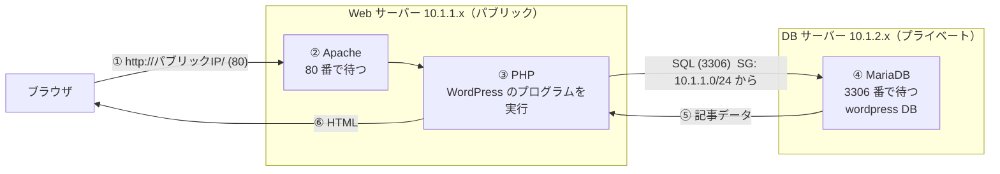

# Day3: Web サーバーと DB サーバーをつないで、ブログを動かす（第4回フォローアップ会）

**今日のゴール**: DB サーバーに MariaDB を、Web サーバーに WordPress を入れて、ブラウザで自分のブログを表示する。
そして「ブラウザ → Apache → PHP → MariaDB → HTML」というデータの流れを自分の言葉で説明できるようになる。

所要時間の目安: 90〜120 分

---

## 目次

1. [今日作るもの](#1-今日作るもの)
2. [準備（NAT の作り直し）](#2-準備nat-の作り直し)
3. [DB サーバーに MariaDB を入れる](#3-db-サーバーに-mariadb-を入れる)
4. [WordPress 用のデータベースとユーザーを作る](#4-wordpress-用のデータベースとユーザーを作る)
5. [Web サーバーから DB に接続する](#5-web-サーバーから-db-に接続する)
6. [Web サーバーに WordPress を入れる](#6-web-サーバーに-wordpress-を入れる)
7. [詰まったとき](#7-詰まったとき)
8. [演習3（個人ワーク）: sample.php で WordPress の裏側を再現する](#8-演習3個人ワーク-samplephp-で-wordpress-の裏側を再現する)
9. [締めの儀式: 全部消して、請求が 0 になるのを確認する](#9-締めの儀式-全部消して請求が-0-になるのを確認する)
10. [3 日間のまとめ](#10-3-日間のまとめ)

---

## 1. 今日作るもの

ネットワークは Day2 までで完成しています。今日は**サーバーの中に入れるソフト**が主役です。



| 番号 | 何が起きるか |
|---|---|
| ① | ブラウザが Web サーバーの 80 番にリクエストを送る |
| ② | Apache が受け取り、`.php` ファイルなら PHP に渡す |
| ③ | PHP（WordPress）が「記事をください」という SQL を組み立てる |
| ④ | MariaDB が 3306 番で受け取り、`wp_posts` というテーブルから行を返す |
| ⑤ | PHP が受け取ったデータを HTML に整形する |
| ⑥ | Apache がその HTML をブラウザに返し、記事が表示される |

③ と ④ の間だけがプライベートサブネットをまたぎます。**画面（Web）とデータ（DB）は別の場所にある。だから DB は隠し、Web だけ公開する**、が今日までの構成の意味です。

**サーバーを 2 層で考える**

| | Web サーバー | DB サーバー |
|---|---|---|
| ハード（置き場所、Day1〜2 で作った） | パブリックサブネット、パブリック IP あり、SG: 22・80 | プライベートサブネット、パブリック IP なし、SG: 22・**3306（今日追加）** |
| ソフト（中で動くもの、今日入れる） | Apache、PHP、WordPress、mysql クライアント | MariaDB、`wordpress` データベース、`wordpress` ユーザー |

**今日使う値（全員共通）**

| 項目 | 値 |
|---|---|
| データベース名 | `wordpress` |
| DB ユーザー名 | `wordpress` |
| DB ユーザーのパスワード | `wordpresspasswd` |
| MariaDB の root パスワード | 自分で決める（**メモ必須**） |
| DB のポート | `3306` |

---

## 2. 準備（NAT の作り直し）

### 2-1. Day2 の環境があること

Web サーバー `kikagaku-cli-ec2` と DB サーバー `kikagaku-cli-ec2-private` の 2 台が必要です。停止していた人は起動し、**Web サーバーの新しいパブリック IP** をメモしてください（DB サーバーのプライベート IP は変わりません）。

Day2 を欠席した／消してしまった人は、[../README.md](../README.md) の `stage2-day2.yaml` で 5 分で作れます（`EnableNat=true` で）。

### 2-2. NAT ゲートウェイを作り直す

Day2 の宿題で NAT と Elastic IP を消した人は、今日 DB サーバーが `dnf` で MariaDB を取りに外へ出るため、**作り直し**が必要です。

1. VPC → NAT ゲートウェイ → 作成: 名前 `kikagaku-handson1-ngw`、サブネット **`kikagaku-cli-public-subnet`**、「Elastic IP を割り当て」
2. VPC → ルートテーブル → `kikagaku-cli-rtb-private` → ルートを編集 → `0.0.0.0/0` のターゲットを**新しい NAT** に付け替えて保存（古い NAT を指したままの行は「ブラックホール」と表示されます）
3. NAT が「使用可能」になるまで数分待つ

確認: 踏み台経由で DB サーバーに入り（Day2 の 5 章）、`curl https://ifconfig.me` で NAT の Elastic IP が返れば OK です。

### 2-3. ターミナルを 2 つ

- 窓 1: Web サーバー → DB サーバー（`ip-10-1-2-x`）。3〜4 章で使う
- 窓 2: Web サーバー（`ip-10-1-1-x`）。5〜6 章で使う

---

## 3. DB サーバーに MariaDB を入れる

窓 1 で、Web サーバー経由で DB サーバーに入ります（Day2 の 5 章）。プロンプトが **`ip-10-1-2-x`** になっていることを確認してから進めてください。

### 3-1. インストールと起動

```bash
sudo dnf install -y mariadb105-server
```

30 秒ほどかかります。NAT が正しく動いていれば通ります。固まる場合は 2-2 を確認してください。

```bash
mysql --version
```

`mysql  Ver 15.1 Distrib 10.5.x-MariaDB` のように出れば OK です。MariaDB は MySQL と互換性があり、コマンド名は `mysql` のままです。

```bash
sudo systemctl start mariadb
sudo systemctl enable mariadb
sudo systemctl status mariadb
```

`Active: active (running)` なら動いています（`q` で表示を抜けます）。

**何をしているか**: Day1 の Apache と同じ流れです。`dnf` で入れて、`systemctl start` で起動、`enable` で再起動後も自動起動。違いは、入れたのが Web サーバー（httpd）ではなくデータベース（mariadb）だという点だけです。

### 3-2. 初期設定（root パスワードなど）

```bash
sudo mysql_secure_installation
```

対話式で 7 つ聞かれます。答え方:

| 質問 | 答え | 意味 |
|---|---|---|
| Enter current password for root (enter for none): | **Enter**（空） | 初期状態はパスワードなし |
| Switch to unix_socket authentication [Y/n] | **n** | OS ユーザーと DB ユーザーを連動させない |
| Change the root password? [Y/n] | **Y** → 任意のパスワードを 2 回 | **必ずメモ**。後で使います |
| Remove anonymous users? [Y/n] | **Y** | 名前のないユーザーを消す |
| Disallow root login remotely? [Y/n] | **Y** | root では外から入れなくする。アプリは専用ユーザーで繋ぐのが原則 |
| Remove test database and access to it? [Y/n] | **Y** | お試し用 DB を消す |
| Reload privilege tables now? [Y/n] | **Y** | 設定を反映 |

`Thanks for using MariaDB!` と出れば完了です。

**何をしているか**: 「全能の root を日常で使わない」「外からは専用ユーザーだけ」という、Day2 の「層3: 認証」の設定です。AWS の IAM で「ルートユーザーは使わず IAM ユーザーで作業する」のと同じ考え方です。

---

## 4. WordPress 用のデータベースとユーザーを作る

### 4-1. root で DB に入る

```bash
mysql -u root -p
```

3-2 で決めた root パスワードを入れると、プロンプトが `MariaDB [(none)]>` に変わります。ここからは SQL を打ちます。

**何をしているか**: `mysql` は DB に接続して操作する「クライアント」です。`-u root` はユーザー、`-p` はパスワードを聞いてもらう指定です。

まず今ある DB を見てみます。

```sql
SHOW DATABASES;
```

```
+--------------------+
| Database           |
+--------------------+
| information_schema |
| mysql              |
| performance_schema |
+--------------------+
```

この 3 つは MariaDB 自身が使うシステム用の DB です。**触らないでください**（消すと MariaDB が動かなくなります）。

### 4-2. データベースを作る

```sql
CREATE DATABASE wordpress DEFAULT CHARACTER SET utf8 COLLATE utf8_general_ci;
```

**何をしているか**: `wordpress` という名前の DB を、日本語が扱える文字コード（UTF-8）で作っています。もう一度 `SHOW DATABASES;` を打つと、`wordpress` が増えているはずです。

> **SQL の書き方**: `CREATE` `DATABASE` のような決まった単語（予約語）は大文字、自分で付ける名前は小文字で書くのが慣習です（`create database wordpress` でも動きます）。文の最後は `;` で終わります。

### 4-3. ユーザーを作って権限を渡す

```sql
GRANT ALL ON wordpress.* TO 'wordpress'@'10.1.%' IDENTIFIED BY 'wordpresspasswd';
```

**何をしているか**（1 行に 4 つの意味があります）

| 部分 | 意味 |
|---|---|
| `GRANT ALL` | すべての権限（読み書き・テーブル作成など）を渡す |
| `ON wordpress.*` | `wordpress` DB の中の全テーブルに対して |
| `TO 'wordpress'@'10.1.%'` | `wordpress` というユーザーを作り、**`10.1.` で始まる IP からだけ**接続を許す（`%` はワイルドカード。`10.1.0.0/16` ＝ VPC の中、と同じ意味） |
| `IDENTIFIED BY 'wordpresspasswd'` | パスワードは `wordpresspasswd` |

Day1 の CIDR `/16` が、DB の世界では `10.1.%` という書き方で出てきた、と思ってください。

確認:

```sql
SELECT user, host FROM mysql.user;
```

```
+-------------+-----------+
| User        | Host      |
+-------------+-----------+
| wordpress   | 10.1.%    |   ← これ
| mariadb.sys | localhost |
| mysql       | localhost |
| root        | localhost |   ← root は localhost からだけ（3-2 の設定）
+-------------+-----------+
```

DB から抜けます。

```sql
\q
```

プロンプトが `[ec2-user@ip-10-1-2-x ~]$` に戻ります。

---

## 5. Web サーバーから DB に接続する

DB サーバーの中では DB に入れました。次は **Web サーバーから**入れるようにします。これが「Web と DB の 2 層」をつなぐ作業です。

| 用途 | 接続元（クライアント） | 接続先（サーバー） |
|---|---|---|
| 4 章でやったこと | DB サーバー自身 | DB サーバー（localhost） |
| これからやること | **Web サーバー** | DB サーバー（リモート） |

必要なのは 2 つです。

1. DB サーバーの SG に「Web サーバーからの 3306 番」を許可する
2. Web サーバーに `mysql` コマンド（クライアント）を入れる

### 5-1. DB がどのポートで待っているか見る

窓 1（DB サーバーの中）で、Day1 でも使ったコマンド:

```bash
sudo lsof -i -n -P | grep LISTEN
```

```
sshd      ...  TCP *:22   (LISTEN)
mariadbd  ...  TCP *:3306 (LISTEN)     ← MariaDB が 3306 番で待っている
```

DB サーバー側の準備はできています。でも SG は 22 番しか通していません。Day1 の「Apache は動いているのに 80 番が閉まっていて繋がらない」と同じ状況です。

### 5-2. SG に 3306 番を足す

コンソール: EC2 → インスタンス → `kikagaku-cli-ec2-private` → 「セキュリティ」タブ → セキュリティグループ `kikagaku-cli-sg-private` → 「インバウンドルールを編集」→「ルールを追加」

| 項目 | 値 |
|---|---|
| タイプ | **MYSQL/Aurora**（選ぶとポートが自動で 3306 になる） |
| ソース | カスタム **`10.1.1.0/24`**（パブリックサブネット ＝ Web サーバー側） |

保存します。

> **実務では**: ソースを CIDR ではなく「Web サーバーの SG の ID」で指定します。そうすると「その SG が付いているサーバーからだけ」になり、IP が変わっても効きます。今日は Notion に合わせて CIDR で書きます。

> **CLI でやる場合**
> ```bash
> SG_PRIV_ID=$(aws ec2 describe-security-groups --filters Name=group-name,Values=kikagaku-cli-sg-private --query 'SecurityGroups[0].GroupId' --output text)
> aws ec2 authorize-security-group-ingress --group-id $SG_PRIV_ID --protocol tcp --port 3306 --cidr 10.1.1.0/24
> ```

### 5-3. Web サーバーに mysql クライアントを入れて、接続する

窓 2（Web サーバーの中、`ip-10-1-1-x`）で:

```bash
sudo dnf install -y mariadb105-server
```

**何をしているか**: Web サーバーで DB を動かすわけではありません。DB に接続するための `mysql` コマンドが、このパッケージに入っているので入れています（Notion と同じ手順です。クライアントだけの `mariadb105` パッケージでも構いません）。

接続してみます。`（DBのプライベートIP）` は `10.1.2.x` です。

```bash
mysql -h （DBのプライベートIP） -u wordpress -p wordpress
```

パスワードは `wordpresspasswd` です。

| オプション | 意味 |
|---|---|
| `-h` | 接続先ホスト（DB サーバーのプライベート IP） |
| `-u wordpress` | ユーザー名 |
| `-p` | パスワードを聞いてもらう |
| 最後の `wordpress` | 接続する DB 名 |

`MariaDB [wordpress]>` になれば、**Web サーバーから DB サーバーに繋がりました。** 3 日間で作った 2 層が初めて会話した瞬間です。

```sql
SHOW DATABASES;
```

root ではないので、`wordpress` ユーザーが見られる DB だけ（`information_schema` と `wordpress`）が出ます。

```sql
exit
```

> **なぜ DB のホストにプライベート IP を使うのか**: Web → DB は VPC の中の通信なので、外向きの IP を使う理由がありません。それに、プライベート IP は停止→起動しても変わりません（パブリック IP は変わります）。この後 WordPress の設定にもこのプライベート IP を書きます。

---

## 6. Web サーバーに WordPress を入れる

窓 2（Web サーバーの中）で進めます。

### 6-1. PHP などを入れる

```bash
sudo dnf install -y wget php-mysqlnd php-fpm php-mysqli php-json php php-devel
```

**何をしているか**: WordPress は PHP というプログラミング言語で書かれています。PHP 本体と、PHP から MariaDB に接続するための部品、ファイルをダウンロードする `wget` をまとめて入れています。

| パッケージ | 役割（今は「そういうものがある」で OK） |
|---|---|
| `php` | PHP 本体。WordPress のプログラムを実行する |
| `php-mysqlnd` / `php-mysqli` | PHP から MySQL / MariaDB に接続する |
| `php-fpm` | Apache と連携して PHP を速く動かす |
| `php-json` | JSON というデータ形式を扱う |
| `wget` | URL からファイルを取ってくる |

### 6-2. WordPress 本体を置く

```bash
wget https://wordpress.org/latest.tar.gz
ls                      # latest.tar.gz があるか
tar -xzf latest.tar.gz  # 解凍
ls wordpress            # .php ファイルがたくさん出てくる
```

Apache が返すフォルダ `/var/www/html` の中身を、WordPress のファイルに入れ替えます。

```bash
sudo rm -r /var/www/html/*
sudo cp -r wordpress/* /var/www/html/
ls /var/www/html/
```

**何をしているか**: Day1 では `/var/www/html/index.html` を返していました。WordPress では代わりに `.php` ファイルが動いて HTML を作ります。だからフォルダの中身をまるごと差し替えています。

### 6-3. 所有者を apache にして再起動

```bash
sudo chown apache:apache /var/www/html/ -R
sudo systemctl restart httpd
```

**何をしているか**: Apache は `ec2-user` ではなく `apache` というユーザーで動いています。この後ブラウザから DB 情報を入力すると、WordPress が `wp-config.php` という設定ファイルを**自分で書き込む**ので、`apache` ユーザーに書き込み権限が必要です。`chown` は所有者を変えるコマンド、`-R` はフォルダの中身全部に、という意味です。**ここを忘れると 6-4 で「設定ファイルを書き込めません」になります。**

### 6-4. ブラウザで WordPress を設定する

自分の PC のブラウザで:

```
http://（WebサーバーのパブリックIP）/
```

WordPress の**言語選択画面**が出れば成功です。「日本語」を選び「続ける」→「さあ、始めましょう！」

DB の情報を入力します。

| 項目 | 値 |
|---|---|
| データベース名 | `wordpress` |
| ユーザー名 | `wordpress` |
| パスワード | `wordpresspasswd` |
| データベースのホスト名 | **DB サーバーのプライベート IP（10.1.2.x）** |
| テーブル接頭辞 | `wp_` のまま |

「送信」→「インストール実行」

**何をしているか**: 5-3 で手で打った `mysql -h 10.1.2.x -u wordpress -p wordpress` と同じ情報を、WordPress に教えています。WordPress はこれを `wp-config.php` に書き、以後の通信はこのファイルを見て行われます。

サイトのタイトル、管理者ユーザー名、パスワード、メールアドレスは自由に決めて「WordPress をインストール」→「ログイン」。

管理画面（ダッシュボード）が出たら完成です。**あなたは 3 日間で、ネットワーク・サーバー・データベース・アプリケーションを全部自分の手で作りました。**

ダッシュボードから「投稿 → 新規追加」で記事を 1 本書いて公開してみてください。`http://（パブリックIP）/` を開くと、その記事が表示されます。

---

## 7. 詰まったとき

| 症状 | 原因 | 対処 |
|---|---|---|
| DB サーバーで `dnf` が固まる | NAT がない／ルートが古い NAT（ブラックホール）を指している | 2-2 で作り直し、ルートの行き先を確認 |
| `mysql_secure_installation` で何を答えるか分からない | 対話式で 7 つ聞かれる | 3-2 の表のとおり。root パスワードは必ずメモ |
| Web から `mysql -h` で **タイムアウト** | DB の SG に 3306 がない | 5-2 |
| Web から `mysql -h` で `Access denied` | パスワード違い／ユーザーを `10.1.%` で作っていない | 4-3 をやり直す（同じ GRANT をもう一度打てば OK） |
| Web から `mysql -h` で `Can't connect ... (111)` | ホストに**パブリック** IP を書いた／DB が起動していない | プライベート IP（10.1.2.x）を使う。DB サーバーで `systemctl status mariadb` |
| WordPress 画面で「データベース接続確立エラー」 | ホスト名・ユーザー・パスワードの入力違い | ホスト＝DB のプライベート IP、`wordpress` / `wordpresspasswd` |
| WordPress 画面で「wp-config.php に書き込めません」 | `chown apache` を忘れた | 6-3 |
| ブラウザで It works! のまま／404 | Apache を再起動していない／ファイルの置き場所が違う | `sudo systemctl restart httpd`、`ls /var/www/html/` に `index.php` があるか |
| `10.1.%` の意味が分からない | SQL のワイルドカード | `10.1.0.0/16` と同じ ＝ VPC の中からの接続を許可 |

---

## 8. 演習3（個人ワーク）: sample.php で WordPress の裏側を再現する

WordPress は `.php` ファイルが「ブラウザと DB の間」を取り持っています。その最小版を自分で書いて、仕組みを確かめます。3〜4 人のグループで、詰まったら助け合ってください。

### 手順 1: SQL で記事一覧を見る

窓 2（Web サーバー）から DB に入り:

```bash
mysql -h （DBのプライベートIP） -u wordpress -p wordpress
```

```sql
SELECT id, post_title, post_status, post_type FROM wp_posts;
```

WordPress が最初から用意している記事（Hello world! など）と、6-4 で投稿した記事が行として見えます。`exit` で抜けます。

### 手順 2: ブログで同じ記事を見る

`http://（パブリックIP）/` を開き、手順 1 で見た記事がどう表示されているか見比べます。**DB の行 ＝ 画面の記事**です。

### 手順 3: sample.php を作る

窓 2（Web サーバー）で `/var/www/html/sample.php` を作ります。`sudo nano /var/www/html/sample.php` で開き、次を貼り付けて、**1 行目の IP を自分の DB のプライベート IP に**書き換えてください。

```php
<?php
$host = "10.1.2.xxx";        // ← 自分の DB サーバーのプライベート IP
$user = "wordpress";
$pass = "wordpresspasswd";
$dbname = "wordpress";

$conn = new mysqli($host, $user, $pass, $dbname);
if ($conn->connect_error) {
    die("接続失敗: " . $conn->connect_error);
}

$conn->set_charset("utf8mb4");

echo "✅ 接続成功！<br>";

// WordPress の投稿データ（タイトル）を 5 件だけ取得する SQL
$result = $conn->query("SELECT ID, post_title FROM wp_posts LIMIT 5;");
while ($row = $result->fetch_assoc()) {
    echo "📝 " . $row['ID'] . ": " . $row['post_title'] . "<br>";
}

$conn->close();
?>
```

保存（Ctrl+O → Enter → Ctrl+X）。

**何をしているか**（ざっくりで OK）

| 行 | 意味 |
|---|---|
| `new mysqli(...)` | 5-3 の `mysql -h ... -u ... -p` と同じことを PHP がやっている |
| `$conn->query("SELECT ...")` | 手順 1 と同じ SQL を PHP が DB に投げている |
| `echo "..."` | 結果を文字（HTML）として出力。Apache がそれをブラウザに返す |

### 手順 4: ブラウザで開く

```
http://（パブリックIP）/sample.php
```

「接続成功！」と記事が 5 件出れば完了です。

**流れを言葉にすると**: ブラウザが `sample.php` を要求 → Apache が PHP に渡す → PHP が DB に接続して SQL を投げる → DB が行を返す → PHP が 1 行ずつ HTML にして出力 → Apache がブラウザに返す。WordPress も、これを何百個の `.php` ファイルでやっているだけです。

---

## 9. 締めの儀式: 全部消して、請求が 0 になるのを確認する

「AWS はレゴのように作って壊すのが一番身につく」。最後は全部壊して、翌月の請求が 0 になるところまでがハンズオンです。

**CloudShell に 1 行貼るだけ**で、3 日間で作ったものが全部消えます（消す対象を一覧表示して `yes` を待ちます）。

```bash
bash <(curl -fsSL https://raw.githubusercontent.com/kikagaku/aws-handson-cloudformation/main/scripts/cleanup.sh)
```

コンソールで手動で消す場合は、この順番です（内側から外側へ。Day1 の「作る順番」の逆）。

| 順番 | 消すもの | 場所 |
|---|---|---|
| 1 | EC2 2 台を「**終了**」（停止ではない） | EC2 → インスタンス |
| 2 | NAT ゲートウェイ（「削除済み」まで数分待つ） | VPC → NAT ゲートウェイ |
| 3 | Elastic IP を「**解放**」 | VPC → Elastic IP |
| 4 | VPC `kikagaku-cli-vpc` を削除（サブネット・IGW・ルートテーブル・SG も一緒に消える） | VPC → お使いの VPC |
| 5 | 翌日以降に請求ダッシュボードを確認 | 右上のアカウント名 → 請求とコスト管理 |

詳しくは [../docs/cleanup-manual.md](../docs/cleanup-manual.md) を見てください。キーペアは課金されないので残して構いません。

---

## 10. 3 日間のまとめ

| 日 | テーマ | 覚えておくこと |
|---|---|---|
| Day1 | **繋がる** | 作る順番は VPC → サブネット → IGW → ルート → SG → EC2。タイムアウト＝経路、拒否＝サーバー |
| Day2 | **隠す** | パブリックかプライベートかはルートテーブルで決まる。踏み台で入り、NAT で出る。NAT は消し忘れると課金 |
| Day3 | **動く** | ブラウザ → Apache → PHP → MariaDB → HTML。root を日常で使わない。画面とデータは別の場所にある |

**今日の構成の弱点と、実務での答え**（次に学ぶことの地図です）

| 弱点 | 実務の答え |
|---|---|
| Web サーバーが 1 台。落ちたら止まる | ALB ＋ Auto Scaling で複数台に分散 |
| DB を EC2 で自前運用。バックアップも復旧も自分 | RDS（Multi-AZ）に任せる |
| パブリック IP に直接アクセス、http のまま | Route 53 で独自ドメイン ＋ ACM で https |
| 踏み台に鍵を置く | SSM Session Manager（22 番を開けない） |
| 手で作ったので、もう一度同じものを作れない | CloudFormation / Terraform（このリポジトリの `stage*.yaml` がその第一歩） |

**次の一歩（おすすめ順）**

1. このリポジトリの `stage3-day3.yaml` を読む。今日手で打ったコマンドが、YAML の 1 行 1 行に対応しています
2. DB サーバーを RDS に置き換えてみる（WordPress の設定はホスト名を変えるだけ）
3. SAA の問題集を「ネットワーク」領域から解く。3 日間で触った構成がそのまま問題文に出ます
4. 詰まったら「症状・原因・対処」の表の形でメモを残す。自分専用の詰まり表になります
